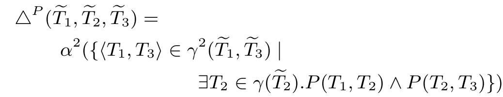
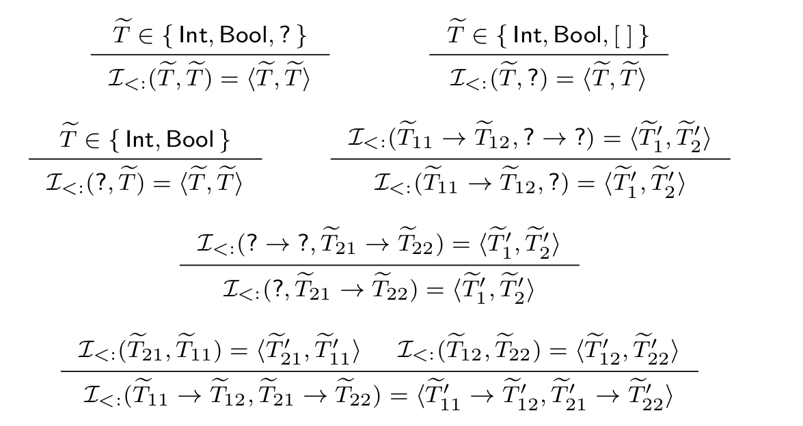

 Building Gradualized Typesystems
====================================

Wat is een gradueel typesysteem?
--------------------------------

Sommige typesystemen zijn krachtiger dan andere:

- Python is volledig dynamisch
- Java heeft statische typechecking
- Haskell heeft een nog krachtiger typesysteem

Een gradueel typesysteem introduceert _onzekerheid_ 

Delen van de code zijn statisch getypeerd, andere zijn afgezwakt

De programmeur kiest zelf de mate waarin

Voorbeeld
---------

	(\\ x : Int . x + 1) True

Gradualizatie introduceert `?`:

        (\\ x : ? . x + 1) True

We zijn __optimistisch__ dat dit lukt!

        True + 1

Hier loopt de runtime vast en krijgen we een _dynamische_ fout

Waarom is een gradueel typesysteem nuttig?
------------------------------------------

Veel software begint met een _PoC_ in een dynamische taal (e.g. Python)\
\

Deze POC wordt vaak uitgebreid en uitgebreid totdat het moeilijk wordt om dit onder controle te houden...
... maar ook duur om te herschrijven

In een gradueel systeem kiest de programmeur kiest zelf hoeveel typering nodig is

Waarom zijn er niet meer graduele typesystemen?
-----------------------------------------------

Een typesysteem gradualizeren is moeilijk en handmatig werk

Mijn tool __automatiseert__ het gradualizeren van typesystemen voor __arbitraire talen__

Gradualizatie
-------------

 - Invoeren van de programmeertaal
 - Bouwen van een gradueel typesysteem
 - Bouwen van een dynamische runtime

Snel en efficiënt

Definitie van een programmeertaal
=================================

Definitie van een programmeertaal
---------------------------------

 - Syntax: hoe ziet de programmeertaal eruit?
 - Semantiek: hoe wordt ze geëvalueerd?
 - Eigenschappen

STFL: Syntax
------------

$$STFL.language![10..26]!indent

STFL: Evaluator
--------------

$$STFLForSlides.language![65..76]!indent!safe

STFL: evaluator
---------------

Op dit punt kunnen we onze programmeertaal uitvoeren!
Dit door een afleidingboom op te bouwen

Gegeven het voorbeeld `1 + 2` krijgen we:

	1 : number    2 : number
	------------------------ [EvalPlus]
	1 + 2 -> 3

STFL: evaluator
---------------

Op dit punt kunnen we onze programmeertaal uitvoeren!
Dit door een afleidingboom op te bouwen

Gegeven het voorbeeld `If True Then False Else True` krijgen we:

	------------------------------------ [EvalIfTrue]
	If True Then False Else True → False

STFL: evaluator
---------------

Op dit punt kunnen we onze programmeertaal uitvoeren!
Dit door een afleidingboom op te bouwen

Gegeven het voorbeeld `(\x . Int : x + 1) 41` krijgen we:

	---------------------------------- [EvalLamApp]
	( \ x : Int . x + 1 ) 41 → 41 + 1

STFL: typesysteem
------------------

Het typesysteem kunnen we analoog opstellen

STFL: Rules
-----------

$$STFLForSlides.language![158..161]!indent!safe

STFL: typesysteem
-----------------

$$STFLForSlides.language![128..130]!indent!safe

STFL: Functions
---------------

Pattern matching clauses

$$STFL.language![30..42]!indent

Bewijsboom voor typering
------------------------

	True : bool            False : bool        
	---------------        -----------------    
	{} |- True, Bool       {} |- False, Bool   
	----------------------------------------
	{} |- If True Then False Else True, Bool
	----------------------------------------
	If True Then False Else True :: Bool

STFL: Typechecken
-----------------

		                1 : number                                                  
	----------------------  ----------------
	x : Int , {} |- x, Int   {} |- 1, Int                                     
	----------------------------------------
	x : Int , {} |- x + 1, Int                                     
	----------------------------------------
	{} |- ( \ x : Int . x + 1 ), Int -> Int 
	----------------------------------------
	{} |- ( \ x : Int . x + 1 ) 5, Int

STFL: properties
----------------

__Arbitraire__ eigenschappen kunnen beschreven worden
Deze worden automatisch getest

$$STFLForSlides.language![190..197]!indent!safe

\

Als iemand het halting-probleem oplost, zal er ook een automatische bewijzer worden toegevoegd

Hulmiddelen
-----------

Abstracte interpratatie van functies en regels

Genereren van parsebomen als afbeelding

Genereren van subtyperingsrelatie als afbeelding

Foutdetectie

Checks
------

Linkse recursie of cycles in subtypering in de syntax

	

Checks
------

Totality-check

	  While checking the totality of function "cod":
	    Following calls will fall through:
	      codomain("Bool")
	      codomain("Int")

Checks
------

Dead-clauses check

	  While checking liveability of every clause in function "eval":
	    eval(("(" "\\" x ":" t "." e ")") arg)

Checks
------

Detectie van kleinere types

	While checking that the functions do have the strictest possible types:
    	 "id" can be typed as "value", instead of a "e"

ALGT
----

Gebaseerd op bestaand werk

Degelijke, geïntegreerde en uitbreidbare basis om programmeertalen te beschrijven en transformeren

Mogelijke uitbreidingen

 - syntax highlighting
 - latex-rendering
 - scoping-informatie
 - automatisch refactoren
 - IDE-tools
 - ...

Gradualizatie
=============

AGT-paper
---------

Gebaseerd op de paper _Abstracting Gradual Typing_ (Ronald Garcia, Alison M.Clark, Éric Tanter)

Biedt een theoretisch framework om typesystemen met de hand om te zetten

Deze thesis onderzoekt in de hoeverre dit __gemechaniseerd__ kan worden

 Syntax
--------

	type	::= "Bool" | "Int" | type "->" type
	

	type	::= "Bool" | "Int" | "?" | type "->" type

 Functies
----------

De paper gebruikt abstract interpretatie om te bepalen wat `?` moet geven

	domain("?")	= "?"

Functies
--------

We zetten "?" om in een verzameling van mogelijke waarden `{Int, Bool, Int -> Int, Int -> Bool, ...}`

We voeren de functie uit op deze oneindige verzameling

We hopen dat dit eindig is

We zetten dit terug om naar een concreet type

Typesysteem
-----------

De regels moeten in essentie niet aangepast worden

(Al is functies hernoemen wel nuttig, bv. `equate` naar `is consistent with`)

Dynamische runtime
==================

Bewijs bijhouden
----------------

	(\x : ? . x + 1) True

Mogelijke optimistische typering: `<Bool, Bool>`

Bewijs evolueren
----------------

Met behulp van consistente transitiviteit kunnen we dit doen

Wanneer geen transitiviteit mogelijk is, vinden we een dynamische fout

Initieel bewijs opstellen
-------------------------

Initieel bewijs: regels opstellen met gevallen-onderzoek

Conclusie
=========

Samengevat
----------

_ALGT_ is flexibele en bruikbare tool om arbitraire programmeertalen te beschrijven, interpreteren, testen en transformeren

\

We proberen zoveel mogelijk aspecten van gradualizatie te automatiseren, gebaseerd op de AGT-paper

